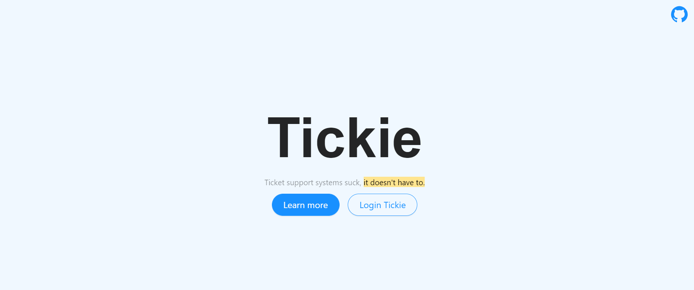
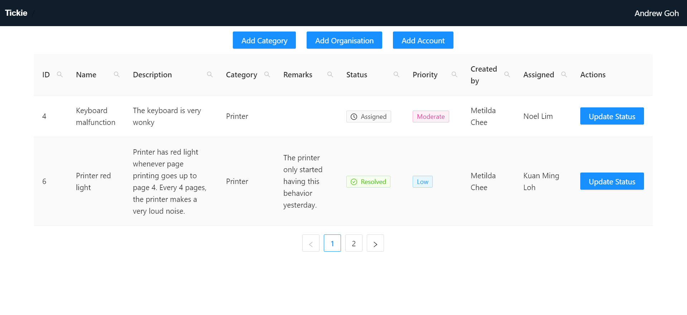
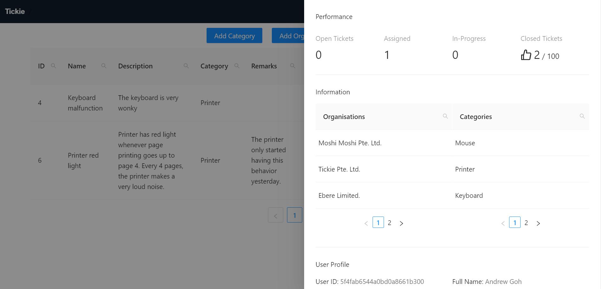

<h1> Tickie - Ticket support systems suck, they don't have to.</h1>

- [What is Tickie?](#what-is-tickie)
- [How does it work?](#how-does-it-work)
  * [Ticket lifecycles](#ticket-lifecycles)
  * [User access controls](#user-access-controls)
- [Technologies used](#technologies-used)
  * [Prototyping](#prototyping)
  * [Development](#development)
    + [Front end](#front-end)
      - [React.js](#reactjs)
      - [Antd](#antd)
    + [Backend](#backend)
      - [Node.js, Express, MongoDB](#nodejs--express--mongodb)
    + [Tools](#tools)
      - [Prettier](#prettier)
  * [Deployment](#deployment)
    + [Docker](#docker)
    + [Heroku](#heroku)
    + [Git pages](#git-pages)
    + [Test account](#test-account)
- [What could have been done better?](#what-could-have-been-done-better)
  * [Potential features](#potential-features)
  * [What could have been done better better?](#what-could-have-been-done-better-better)
  * [References](#references)

# What is Tickie?
[Tickie](https://metildachee.github.io/tickie) is a web based Ticket Support System built on the MERN stack with Antd framework.

# How does it work?
## Ticket lifecycles
A ticket's life cycle evolves as follows:
- Open
  - The ticket initiated by the client.
- Assigned
  - The ticket has been delegated by an administrator to an agent.
- In-progress
  - The agent is working on the ticket.
- Resolved
  - The ticket has been resolved.
- Archived
  - The ticket has been archived.

## User access controls
<table>
  <tbody>
    <tr>
      <th>User type</th>
      <th>Permission</th>
    </tr>
    <tr>
      <td>Client</td>
      <td>
        <ul>
          <li>Add ticket</li>
          <li>View KPI</li>
        </ul>
      </td>
    </tr>
    <tr>
      <td>Admin</td>
      <td>
        <ul>
          <li>Add category</li>
          <li>Add organisation</li>
          <li>Add accounts</li>
          <li>View category, organisation</li>
          <li>Assign tickets</li>
          <li>Archive tickets</li>
        </ul>
      </td>
    </tr>
    <tr>
      <td>Agent</td>
      <td>
        <ul>
          <li>Resolve tickets</li>
          <li>View KPI</li>
        </ul>
      </td>
    </tr>
  </tbody>
</table>

# Technologies used
## Prototyping
[Mockups](https://www.figma.com/files/project/13983308/tickie)

Homepage

Admin dashboard with statuses of tickets and assigned agents.

KPI board for performance review, simple and easy.

## Development
### Front end
#### React.js
React with redux was used for the front-end.
#### Antd
[Antd](https://ant.design/) was used for UI/UX.
### Backend 
#### Node.js, Express, MongoDB
Fully self made REST [API](http://tickie-server.herokuapp.com).
### Tools
#### Prettier
Using prettier script made formatting so much easier! I used a custom script `npm run fmt` and `.prettierignore` to ensure `build` files aren't formatted.
## Deployment
### Docker
The app was containerialized before implementation.
### Heroku
The server is deployed in Heroku.
### Git pages
The client is deployed in Git pages.
### Test account
email: admin@gmail.com
pwd: 123456

# What could have been done better?
## Potential features
1. Logging
2. Comments
3. Allow updates, deletion
4. Uploading of images
5. Notification system
6. Mailer

## What could have been done better better?
1. Hosting on DO/AWS
2. TypeScript server-side
3. Writing test cases

## References
[Freepik](https://www.freepik.com/)

